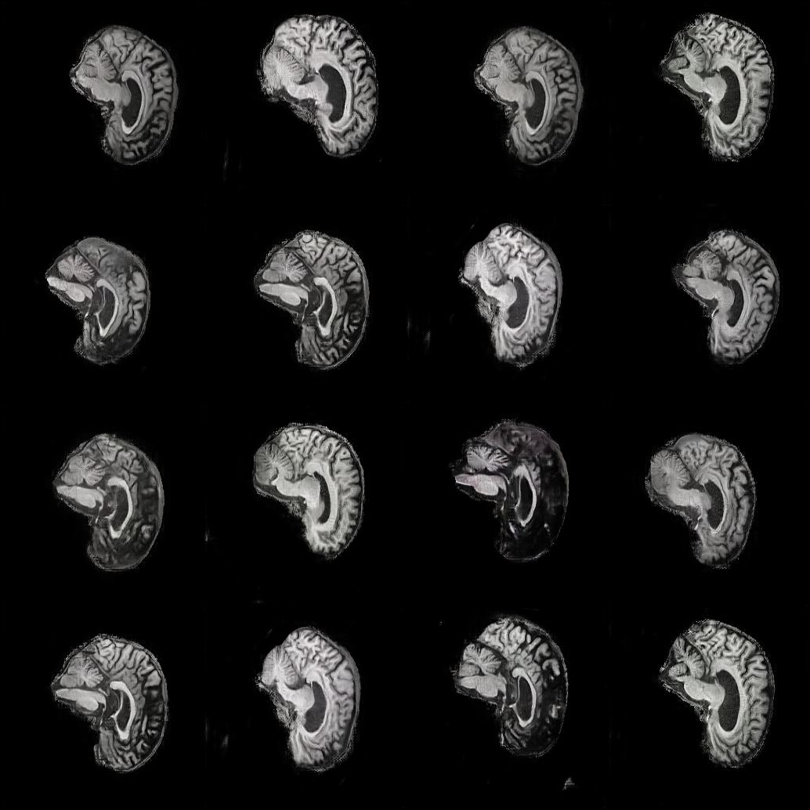
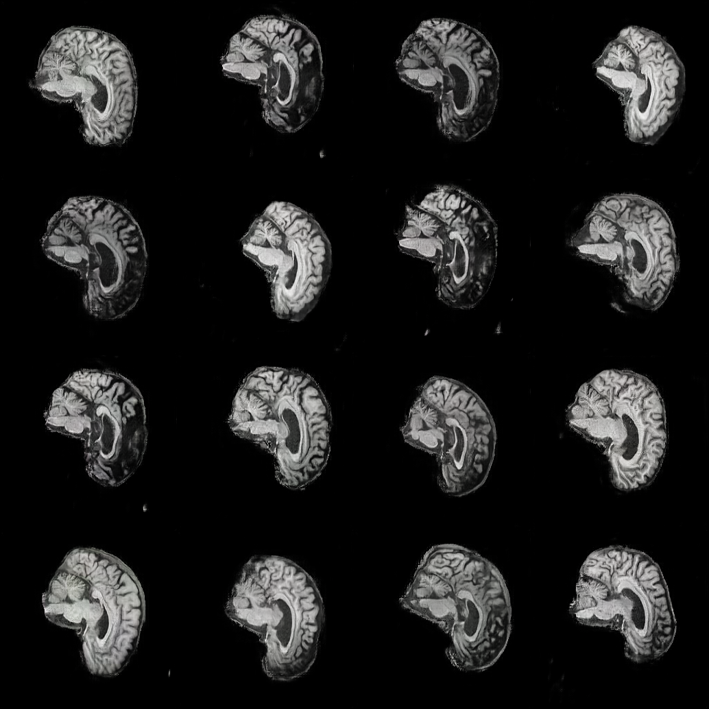
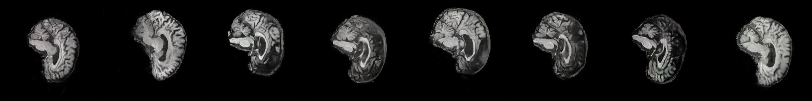
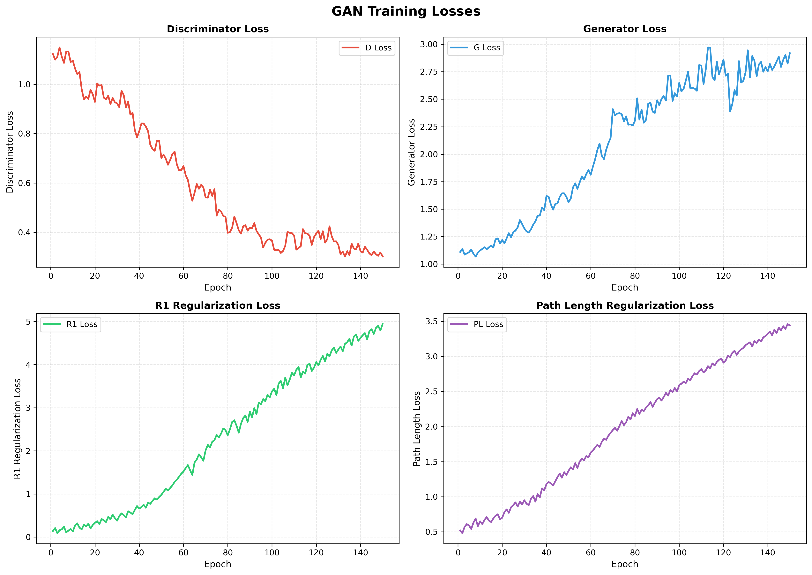

# StyleGAN2 for Alzheimer's Disease vs Normal Control Brain Image Generation

## Overview

This project implements a **StyleGAN2** architecture for generating synthetic brain images conditioned on medical diagnoses: Alzheimer's Disease (AD) versus Normal Control (NC). The algorithm addresses the critical problem of data scarcity in medical imaging by generating high-quality, class-specific synthetic brain images that can augment training datasets for diagnostic models. This approach is particularly valuable in neuroimaging research where obtaining large, balanced datasets is challenging due to privacy concerns, data collection costs, and the relative rarity of certain conditions.

## Algorithm Description

Our implementation uses **projection-based conditional generation** with StyleGAN2 as the backbone architecture. The system learns to generate 256×256 brain images by conditioning the generation process on class labels through two key mechanisms:

1. **Conditional Mapping Network**: Extends the standard StyleGAN2 mapping network by incorporating learned class embeddings. The network takes a random latent vector *z* and a class label, combines them through learned embeddings, and maps them to the intermediate latent space *w*.

2. **Projection Discriminator**: Uses the projection-based conditioning method where class information is incorporated through a dot product between image features and learned class embeddings, added to the standard real/fake classification score.

The training process employs balanced learning rates (discriminator LR = 0.5 × generator LR) to maintain stable adversarial training, along with R1 gradient penalty for the discriminator and path-length regularization for the generator to ensure high-quality, diverse outputs.


*Figure 1: Conditional StyleGAN2 architecture showing the conditional mapping network and projection discriminator*

## How It Works

### Training Process

1. **Data Loading**: Brain images are loaded with corresponding AD/NC labels using PyTorch's ImageFolder, automatically assigning class indices (0=AD, 1=NC).

2. **Conditional Generation**: 
   - Random noise *z* is sampled and combined with class embeddings in the mapping network
   - The resulting *w* vectors control style modulation throughout the generator
   - Generator produces 256×256 RGB brain images conditioned on the class

3. **Discriminator Training**:
   - Real images are evaluated with their true class labels
   - Fake images are evaluated with their intended class labels
   - Projection-based conditioning ensures class-aware discrimination

4. **Regularization**:
   - R1 gradient penalty (applied every 16 steps) stabilizes discriminator training
   - Path-length regularization (applied every 4 steps) ensures smooth latent space

5. **Loss Balancing**: Reduced discriminator learning rate prevents it from overpowering the generator, maintaining training stability.

### Key Features

- **Mixed Precision Training**: Uses PyTorch AMP for memory efficiency on modern GPUs
- **Lazy Regularization**: Applies R1 and path-length penalties intermittently for computational efficiency
- **Progressive Architecture**: Generates images through progressive upsampling from 4×4 to 256×256
- **Class Interpolation**: Can generate smooth transitions between AD and NC characteristics

## Dependencies

```
torch>=2.0.0
torchvision>=0.15.0
matplotlib>=3.5.0
numpy>=1.21.0
tqdm>=4.64.0
Pillow>=9.0.0
```

### System Requirements
- **GPU**: NVIDIA GPU with CUDA support (minimum 8GB VRAM recommended)
- **CUDA**: Version 11.8 or higher
- **Python**: 3.8 or higher

### Installation

```bash
# Clone the repository
git clone <repository-url>
cd ADNI_StyleGAN_Diffusion_48837824

# Install dependencies
pip install torch torchvision matplotlib numpy tqdm Pillow

# Verify CUDA availability
python -c "import torch; print(f'CUDA available: {torch.cuda.is_available()}')"
```

## Usage

### Training

```bash
# Training loop
python train.py
```

### Generation

```bash
# Generate mixed AD/NC samples
python predict.py --checkpoint checkpoints_default/conditional_stylegan2_epoch150.pth --mixed --num_samples 16

# Generate specific class samples
python predict.py --checkpoint checkpoints_default/conditional_stylegan2_epoch150.pth --class_idx 0 --num_samples 16  # AD only
python predict.py --checkpoint checkpoints_default/conditional_stylegan2_epoch150.pth --class_idx 1 --num_samples 16  # NC only

# Generate latent space interpolations
python predict.py --checkpoint checkpoints_default/conditional_stylegan2_epoch150.pth --walk
```

## Example Inputs and Outputs

### Input Data Structure
```
ADNI/AD_NC/train
├── AD/                    # Alzheimer's Disease images
│   ├── subject_001.jpg
│   ├── subject_002.jpg
│   └── ...
└── NC/                    # Normal Control images
    ├── subject_101.jpg
    ├── subject_102.jpg
    └── ...
```

### Training Outputs

The training process generates several types of outputs:

1. **Checkpoints** (`checkpoints/`): Model states saved every 25 epochs
2. **Generated Samples** (`saved_examples/`): Sample images saved every epoch
3. **Training Plots** (`conditional_training_summary.png`): Loss curves and metrics

### Sample Generation Results


*Generated Alzheimer's Disease brain images*

 
*Generated Normal Control brain images*


*Interpolation between AD and NC characteristics*

### Training Progress Visualization


*Training loss curves showing convergence of generator and discriminator*

## Data Preprocessing

### Image Preprocessing Pipeline

```python
train_transform = transforms.Compose([
    transforms.Resize((256, 256)),           # Resize to 256x256
    transforms.RandomHorizontalFlip(),       # Data augmentation
    transforms.ToTensor(),                   # Convert to tensor
    transforms.Normalize([0.5], [0.5])       # Normalize to [-1, 1] for GAN training
])
```

**Justification**: 
- **Resize to 256×256**: Standardizes input size while maintaining sufficient resolution for brain structure details
- **Random Horizontal Flip**: Augments data while being medically valid (brain hemispheres can be flipped)
- **Normalization to [-1, 1]**: Standard practice for GAN training, matches tanh output activation

### Data Splits

- **Training**: 90% of available data
- **Validation**: 10% of available data  
- **Testing**: Generated samples evaluated qualitatively

**Justification**: Given the limited availability of medical imaging data, maximum data is allocated to training while preserving a validation set for monitoring. The 90/10 split is standard practice in medical imaging when data is scarce. Testing focuses on qualitative evaluation of generated samples rather than quantitative metrics due to the generative nature of the task.

## Model Architecture Details

### Generator
- **Input**: 512-dimensional noise vector + class label
- **Mapping Network**: 8-layer MLP with class conditioning
- **Synthesis Network**: Progressive generation from 4×4 to 256×256
- **Style Modulation**: Applied at each resolution level
- **Output**: 256×256×3 RGB images with tanh activation

### Discriminator  
- **Input**: 256×256×3 RGB images + class labels
- **Architecture**: Progressive downsampling with residual connections
- **Conditioning**: Projection-based using learned class embeddings
- **Output**: Single real/fake score per image

### Training Configuration

```python
# Hyperparameters
BATCH_SIZE = 4                   # Memory-efficient for 256x256 generation
LEARNING_RATE_G = 0.002          # Generator learning rate
LEARNING_RATE_D = 0.001          # Reduced discriminator LR for stability
R1_GAMMA = 10.0                  # R1 gradient penalty weight
PL_WEIGHT = 2.0                  # Path length regularization weight
D_REG_INTERVAL = 16              # Apply R1 penalty every 16 steps
G_REG_INTERVAL = 4               # Apply PL penalty every 4 steps
```

## Reproducibility

To ensure reproducible results:

1. **Fixed Random Seeds**: Set in `utils.py` (`RANDOM_SEED = 42`)
2. **Deterministic Operations**: CUDNN benchmark disabled for reproducibility
3. **Version Control**: All dependency versions specified
4. **Checkpoint System**: Complete model states saved including optimizer states

```bash
# For exact reproduction, use the same CUDA version and GPU architecture
export CUDA_VISIBLE_DEVICES=0
python train.py  # Results should be reproducible across runs
```

## Performance Metrics

### Training Stability Indicators
- **Generator Loss**: Target range 1.5-2.5 after convergence
- **Discriminator Loss**: Target range 0.7-1.2 after convergence  
- **R1 Penalty**: Should remain stable around 1.0-5.0
- **Path Length**: Gradual decrease indicating smoother latent space

### Quality Assessment
- **Visual Inspection**: Generated samples should show clear AD vs NC characteristics
- **Interpolation Smoothness**: Gradual transition between classes
- **Diversity**: Generated samples should show variation within each class

## File Structure

```
├── train.py                 # Main training script 
├── predict.py              # Generate samples from trained model
├── modules.py              # Model architectures (Generator, Discriminator, etc.)
├── utils.py                # Utility functions and hyperparameters
├── dataset.py              # Data loading and preprocessing
├── checkpoints/            # Saved model checkpoints
├── saved_examples/         # Generated samples during training
├── generated_samples/      # Final generated outputs
└── plots/                  # Training visualization plots
```

## References

1. Karras, T., et al. "Analyzing and Improving the Image Quality of StyleGAN." *CVPR 2020*.
2. Miyato, T., & Koyama, M. "cGANs with Projection Discriminator." *ICLR 2018*.
3. Mescheder, L., et al. "Which Training Methods for GANs do actually Converge?" *ICML 2018*.

## Citation

If you use this implementation in your research, please cite:

```bibtex
@misc{stylegan2_adni_2025,
  title={Conditional StyleGAN2 for AD vs NC Brain Image Generation},
  author={Tyreece Paul},
  year={2025},
  url={https://github.com/tyreecepaul/PatternAnalysis-2025}
}
```
