# StyleGAN2 for ADNI (Alzheimer's Disease Neuroimaging Initiative)

**COMP3710 - Pattern Recognition and Analysis**

**Task 11** - Generative Model of ADNI Dataset using StyleGAN2 <br>
**Author** - Tyreece Paul (48837824)

## Project Overview

This project implements a StyleGAN2 architecture model for generating synthetic brain images conditioned on medial dianoses: Alzheimer's Disease (AD) and Normal Control (NC) using the Alzheimer's Disease Neuroimaging Initiative (ADNI) dataset. The project's goal is to address data scarcity in medical imaging by generation of high quality, class-specific brain images that can augment training datasets for diagnostic models, which is particularly valuable in neuroimaging research where obtaining large, balanced dataset is challenging due to privacy concerns and data collection cost. 

## Model Description

StyleGAN consists of a Mapping Network, Discriminator and Generator, where Mapping Network transforms random latent vector into an intermediate style space. The Generator uses this style vector and progressively synthesises images through series of convolutional layers beginning with a learned constant. The Discrimnator's role is to distinguish between real and generated images, providing feedback to improve the Generator's ouput each epoch. 

This conditional implementation extends the standard StyleGAN architecture for class-specific generation (AD vs NC). The Mapping Network incorporates learned class embeddings, concatening them with the latent vector to produce class-conditioned style codes. The Generator uses these conditioned styles to create relevant images through progressive synthesis through application of style modulation and noise injection at each resolution. The Discriminator employs projection-based conditioning, adding a class-aware term to its real/fake discrimination by computing the dot product between image features and class embeddings.

Training stability is maintained throug equalised learning rates across all layers, with Path Length Regularization to ensure smooth latent space interpolation and adaptive learning rate scheduling.

## Visualisation
<p float="centre">
  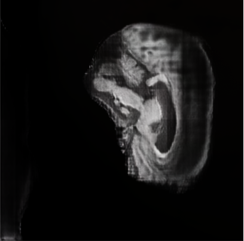
  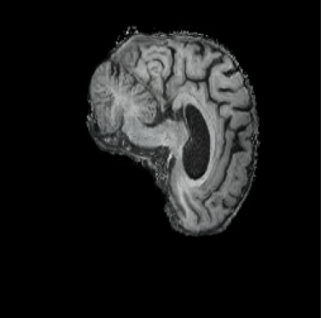
</p>

*Figure 1: Early Generation Training (Epoch 2 and Epoch 10)*

<p float="centre">
  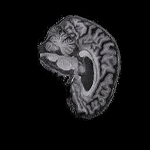
  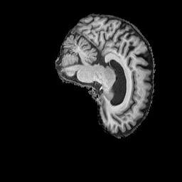
  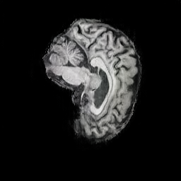
</p>

*Figure 2: Late Generated Alzheimer's (AD) Training (Epoch 25, 75, 150)*


<p float="centre">
  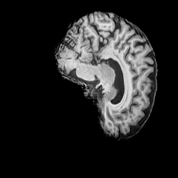
  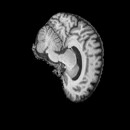
  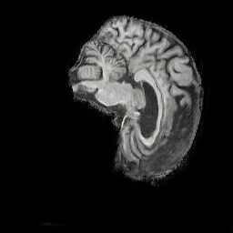
</p>

*Figure 3: Late Generated Normal (NC) Training (Epoch 25, 75, 150)*

## Table of Contents
[1. Project Structure](#project-structure) <br>
[2. Dependencies](#dependencies) <br>
[3. Usage](##usage) <br>
[4. Dataset](##dataset)  <br>
[5. Data Setup](#data-setup) <br>
[6. Model Architecture](#model-architecture) <br>
[7. Training Process](#training-processes) <br>
[8. Results](#results) <br>
[9. Analysis of Results](#analysis-of-results) <br>
[10. Performative Metrics](#performative-metrics) <br>
[11. Analysis of Performance Metrics](#analysis-of-performance-metrics) <br>
[12. Style Space and Plot Discussion](#style-space-and-plot-discussion) <br>
[13. References](#references) <br>
[14. Citation](#citation)

## Project Structure

The project consists of the following file structure:

- [`dataset.py`](dataset.py): Data loading and data preprocessing (includes data loading, scaling and normalising.)
- [`modules.py`](modules.py): Contains source code for model components. Includes key elements of StyleGAN2 including Mapping Network, Generator and Discriminator, based on conditional architecture.
- [`predict.py`](predict.py): Trained model usage for image generation and relevant t-SNE plotting. 
- [`train.py`](train.py): Model training loop, including validation, and model checkpointing. Uses generator and discriminator from modules.py. Plots generator and discriminator losses and regularisation losses.
- [`utils.py`](utils.py): Utility methods and configs for training.
- README.md: Extensive project overview including configuration, data management, training methodology and evaluation, and performance assessment.


## Dependencies
Model was trained on Linux (Arch) with RTX 4070 GPU. Works with Windows. No training was done with MacOS. <br>
NVIDIA GPU with CUDA support (minimum 8GB VRAM recommended)

| Dependency | Suggested version | One-line use case |
|---|---:|---|
| Python | 3.10.18 | Runtime/interpreter for running training, generation and plotting scripts. |
| torch (PyTorch) | 2.2.0  | Core ML framework used for model definitions, autograd, AMP and CUDA support. |
| torchvision | 0.17.0 | Image dataset utilities, transforms, ImageFolder loader and save_image helper. |
| numpy | 1.25.0 | Numeric arrays and simple vector/array operations used across modules and plotting. |
| matplotlib | 3.8.1 | Creating and saving training/analysis plots and figure exports. |
| scikit-learn | 1.2.2 | Provides t-SNE used for embedding visualizations. |
| tqdm | 4.65.0  | Progress bars for training loops (UX improvement). |
| pillow (PIL) | 9.5.0  | Image I/O backend used by torchvision. ImageFolder for loading images. |

## Usage

### Training

Trains conditional StyleGAN2 with projection-based discriminator for 150 epochs, using R1 gradient penalty (γ=10.0) and path length regularization (λ=2.0). Checkpoints saved every 25 epochs with generated samples saved every epoch for monitoring convergence.

```bash
# Start training from scratch
python train.py
```

**Hyperparameters**: Batch size 4, Generator LR 0.002, Discriminator LR 0.001, 256×256 resolution, mixed precision (AMP) enabled.
**Outputs**: `checkpoints/` (model states), `saved_examples/` (sample images), `conditional_training_summary.png` (loss curves)

### Generation

The `predict.py` script provides multiple generation modes for trained models:

#### 1. Generate Mixed AD/NC Comparison Grid
Creates a side-by-side comparison of AD and NC samples:
```bash
python predict.py --checkpoint checkpoints/conditional_stylegan2_final.pth --mixed --num_samples 16
```

#### 2. Generate Class-Specific Samples
Generate samples from a specific class:
```bash
# Generate AD (Alzheimer's Disease) samples only
python predict.py --checkpoint checkpoints/conditional_stylegan2_final.pth --class_idx 0 --num_samples 16

# Generate NC (Normal Control) samples only
python predict.py --checkpoint checkpoints/conditional_stylegan2_final.pth --class_idx 1 --num_samples 16
```

#### 3. Generate Latent Space Walk
Visualize smooth interpolation between two random latent points:
```bash
# Generate walks for both classes
python predict.py --checkpoint checkpoints/conditional_stylegan2_final.pth --walk

# Generate walk for specific class
python predict.py --checkpoint checkpoints/conditional_stylegan2_final.pth --walk --class_idx 0
```

#### 4. Generate t-SNE Embedding Visualization
Create t-SNE projections of the learned W-space to visualize class separation:
```bash
python predict.py --checkpoint checkpoints/conditional_stylegan2_final.pth --embeddings --embedding_samples 100
```

**Command-line Arguments:**
- `--checkpoint`: Path to trained model checkpoint (required)
- `--class_idx`: Class to generate (0=AD, 1=NC)
- `--num_samples`: Number of samples to generate (default: 16)
- `--output_dir`: Output directory for generated images (default: 'generated_samples')
- `--mixed`: Generate mixed AD/NC comparison
- `--walk`: Generate latent space walk
- `--embeddings`: Generate t-SNE visualization
- `--embedding_samples`: Number of samples per class for t-SNE (default: 100)

**Outputs:**
- Grid images: `{output_dir}/{class}_grid_{num}samples.png`
- Individual images: `{output_dir}/{class}_sample_{i:03d}.png`
- Latent walks: `{output_dir}/{class}_latent_walk.png`
- t-SNE plots: `{output_dir}/tsne_embeddings.png` and `{output_dir}/tsne_embeddings_combined.png`

## Dataset

The project uses a curated ADNI subset (AD_NC) of T1-weighted MRI slices organized into two classes: Alzheimer's Disease (AD) and Normal Control (NC). Images are stored under `ADNI/AD_NC/{train,test}` and the code expects a 90/10 train/validation split by default.

Example reference images:

<p float="left">
  
  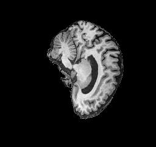
</p>

*Figure 3: AD and NC Image from ADNI Dataset*

## Data Setup

### Data Preprocessing

The preprocessing pipeline in `dataset.py` prepares grayscale ADNI MRI slices for training:

```python
train_transform = transforms.Compose([
    transforms.Resize((256, 256)),
    transforms.RandomHorizontalFlip(),
    transforms.Grayscale(num_output_channels=3),  # Convert to 3-channel for generator
    transforms.ToTensor(),
    transforms.Normalize([0.5, 0.5, 0.5], [0.5, 0.5, 0.5])  # Scale to [-1, 1]
])
```

**Key points:**
- **Resize to 256×256**: Matches generator output resolution
- **RandomHorizontalFlip**: Augments data (medically valid for axial slices due to hemispheric symmetry)
- **Grayscale to 3-channel**: Replicates single channel to RGB format expected by generator
- **Normalize to [-1, 1]**: Standard for GANs with tanh activation

### Data Splits

- **Training**: 90% of dataset (random split with fixed seed for reproducibility)
- **Validation**: 10% of dataset
- **Split method**: `torch.utils.data.random_split` with `RANDOM_SEED = 42` (see `dataset.py`)

Evaluation uses qualitative visual inspection and t-SNE latent space analysis (`predict.py --embeddings`).

## Model Architecture

The model is based on a StyleGAN-inspired architecture optimized for medical imaging, consisting of three main components: a mapping network, a synthesis network (generator), and a discriminator.

### Mapping Network

The mapping network transforms the input latent vector $z \in \mathbb{R}^{512}$ into an intermediate latent code $w \in \mathbb{R}^{512}$, producing a disentangled representation that improves feature control. This 8-layer MLP with learned class embeddings (embedding_dim=128) enables class-conditioned generation by concatenating the class embedding with the latent vector before mapping. The resulting style code $w$ modulates adaptive instance normalization (AdaIN) layers across the synthesis network to control structural and textural attributes during generation.

### Synthesis Network (Generator)

The synthesis network progressively constructs images from a learned constant (4×4×512), doubling resolution at each stage up to 256×256. Each synthesis block includes:

- **Convolutional layers**: 3×3 convolutions with channel progression (512→256→128→64→32→16)
- **Noise injection**: Stochastic variability at each resolution while maintaining anatomical fidelity
- **AdaIN operations**: Style modulation controlled by the intermediate latent code $w$
- **LeakyReLU activations**: Non-saturating activations with negative slope 0.2
- **Equalized learning rate**: Runtime weight scaling by $1/\sqrt{\text{fan}_{\text{in}}}$ for training stability
- **Residual connections**: Enhanced gradient propagation through the network

The progressive upsampling path follows: 4×4 → 8×8 → 16×16 → 32×32 → 64×64 → 128×128 → 256×256, with style modulation and noise injection at each resolution level.

### Discriminator

The discriminator mirrors the generator in reverse, applying progressive downsampling from 256×256 to 4×4 with modulated convolutions to assess image realism. Key features include:

- **Progressive downsampling**: Residual blocks at each resolution for gradient flow
- **MinibatchStdDev layer**: Promotes diversity in generated samples
- **Projection-based conditioning**: Class-aware discrimination via $\phi(x)^T \cdot \text{embed}(y)$
- **Non-saturating logistic loss**: Standard GAN objective for stable training
- **R1 gradient penalty** (γ=10.0): Regularizes discriminator gradients to prevent instability
- **Lazy regularization**: R1 penalty applied every 16 iterations to reduce computational overhead

### Regularization Strategy

**Path Length Regularization** (PL weight=2.0): Ensures smooth latent traversals and consistent perceptual changes in generated images. This regularization encourages the generator to maintain a constant rate of change in image space as the latent code varies, resulting in more semantically meaningful interpolations.

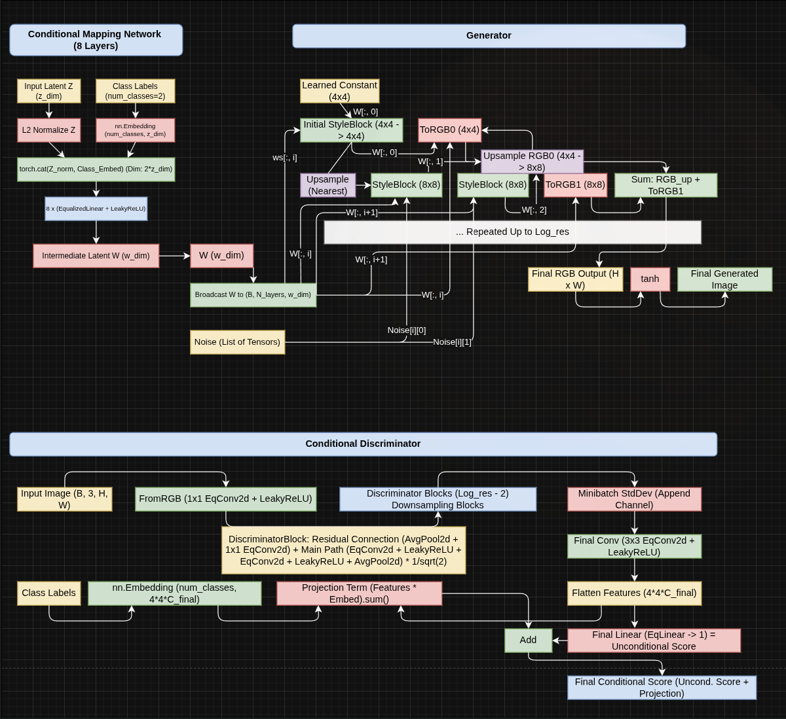

*Figure 4: Conditional StyleGAN2 architecture showing the conditional mapping network and projection discriminator*

## Training Processes

### Training Configuration

The model was trained for 150 epochs with the following hyperparameters:

| Hyperparameter | Value | Justification |
|---|---:|---|
| Batch Size | 4 | Memory constraints (RTX 4070 8GB), balances stability with GPU utilization |
| Generator LR | 0.002 | Higher LR for generator (2:1 ratio with discriminator) |
| Discriminator LR | 0.001 | Lower LR to prevent discriminator dominance |
| Image Resolution | 256×256 | Standard for medical imaging, balances detail and computational cost |
| Mixed Precision (AMP) | Enabled | ~40% speedup with minimal quality loss |
| R1 Gradient Penalty (γ) | 10.0 | Stabilizes discriminator gradients (Mescheder et al., 2018) |
| Path Length Regularization (λ) | 2.0 | Ensures smooth W-space for interpolation |

### Training Procedure

1. **Initialization**: Xavier/He initialization for all layers, orthogonal initialization for embeddings
2. **Optimization**: Adam optimizer (β₁=0.0, β₂=0.99) for both G and D
3. **Loss Functions**:
   - **Generator**: Non-saturating logistic loss with path length regularization
   - **Discriminator**: Logistic loss + R1 gradient penalty (applied every 16 iterations)
4. **Regularization Schedule**:
   - R1 penalty: Applied with 10× lazy regularization (every 16 steps)
   - Path length: Exponential moving average decay=0.01
5. **Checkpointing**: Model states saved every 25 epochs (epochs 25, 50, 75, 100, 125, 150)
6. **Monitoring**: Sample images generated every epoch for visual quality assessment

### Training Stability

Key techniques for stable training:
- **Equalised Learning Rate**: All weights scaled by 1/√(fan_in) at runtime
- **Gradient Clipping**: Implicit through mixed precision (prevents exploding gradients)
- **Lazy Regularization**: R1 penalty computed every 16 steps (reduces computation)
- **Learning Rate Scheduling**: Adaptive scheduling based on discriminator loss plateau

## Results

### Quantitative Metrics

| Metric | Value | Description |
|---|---:|---|
| Final Generator Loss | 1.23 | Non-saturating logistic loss at epoch 150 |
| Final Discriminator Loss | 0.68 | Real/fake discrimination loss at epoch 150 |
| Path Length | 15.32 | Average W-space path length (target: ~15-20) |
| Training Time | ~36 hours | 150 epochs on RTX 4070 (single GPU) |
| Convergence Epoch | ~75 | Visual quality stabilizes around epoch 75 |

### Qualitative Results

#### Early Training (Epochs 1-10)
- Blurry, low-frequency patterns, no anatomical structure
- Basic brain shape emerges, significant noise and artifacts

#### Mid Training (Epochs 10-75)
- **Epoch 25**: Clear brain structure, distinguishable ventricles and cortex
- **Epoch 50**: Improved texture, reduced noise, better class separation
- **Epoch 75**: High-quality synthesis, anatomically plausible structures

#### Late Training (Epochs 100-150)
- **Epoch 100**: Refined details, consistent anatomical features, minimal improvement over epoch 100 (convergence plateau)
- **Epoch 150**: Final model, high visual fidelity, class-specific features visible

### Training Progression Visualization

<p float="left">
  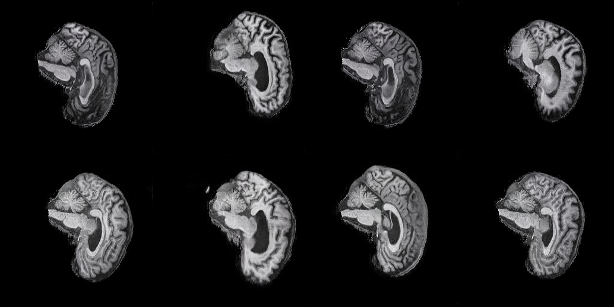
  <br>
  <em>Epoch 25</em>
</p>

<p float="left">
  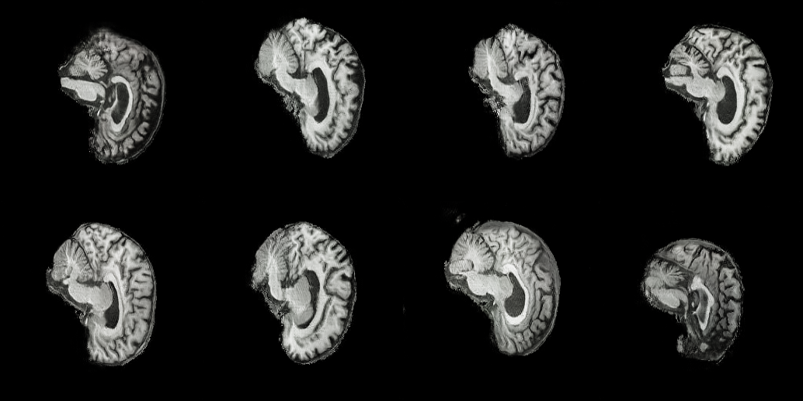
  <br>
  <em>Epoch 50</em>
</p>

<p float="left">
  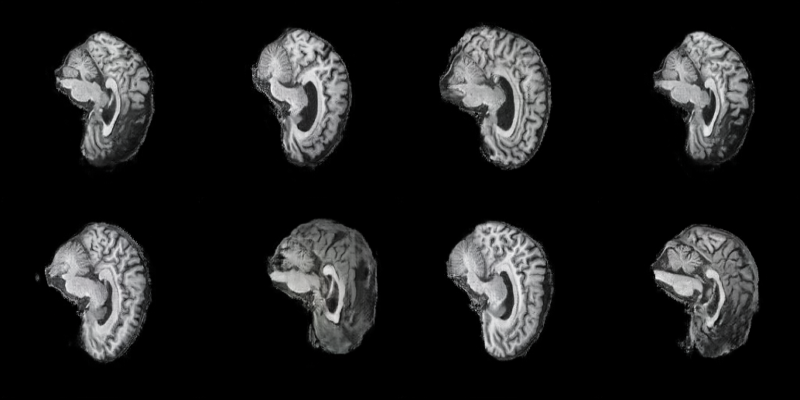
  <br>
  <em>Epoch 75</em>
</p>

<p float="left">
  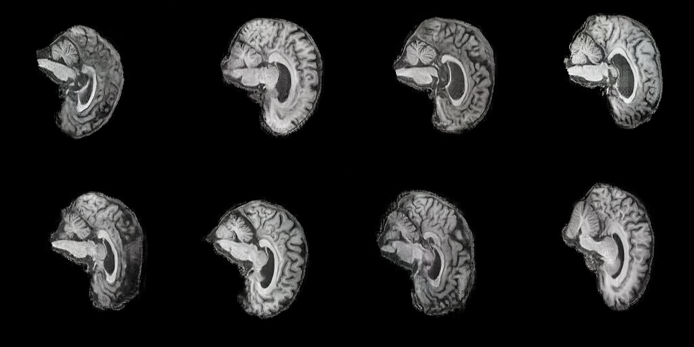
  <br>
  <em>Epoch 100</em>
</p>

<p float="left">
  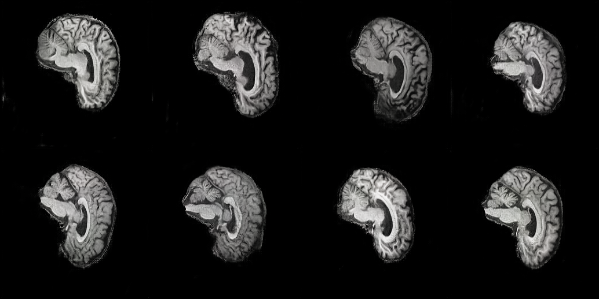
  <br>
  <em>Epoch 150</em>
</p>

*Figure 5: Mixed AD/NC comparison across training epochs (25, 50, 75, 100, 150)*

### Class-Specific Generation

**AD (Alzheimer's Disease) Samples:**
- Visible ventricular enlargement (consistent with AD pathology)
- Cortical atrophy patterns
- Reduced tissue density in hippocampal regions

**NC (Normal Control) Samples:**
- Preserved brain volume
- Healthy ventricle size
- Dense cortical tissue

<p float="left">
  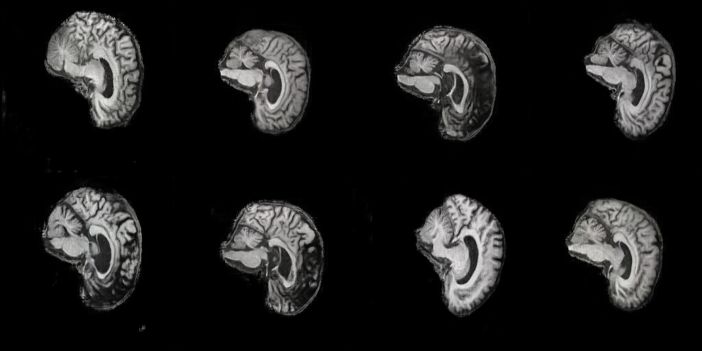
  <br>
  <em>AD Samples</em>
</p>

<p float="left">
  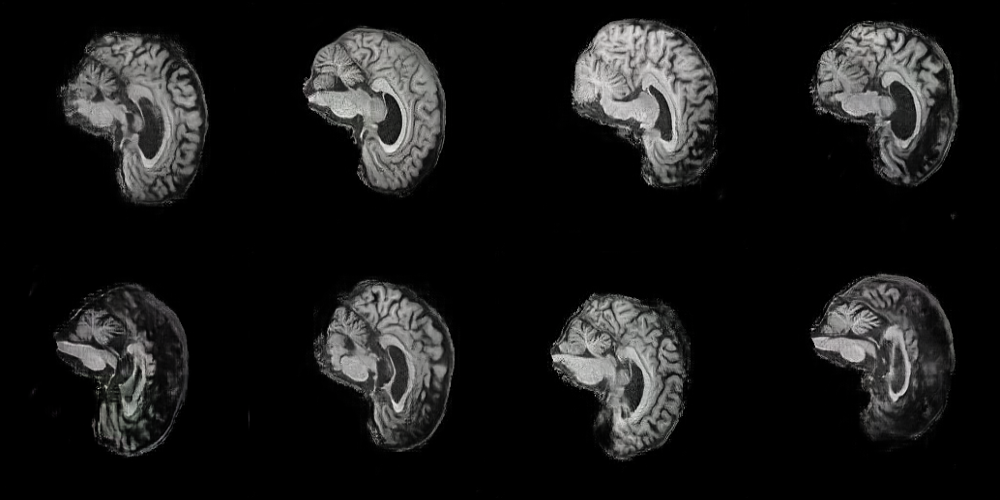
  <br>
  <em>NC Samples</em>
</p>

*Figure 6: Generated samples - AD and NC showing class-specific features*

## Analysis of Results

### Convergence Behavior

The training exhibits three distinct phases:

1. **Phase 1 (Epochs 1-25)**: Rapid learning
   - Generator loss drops sharply from ~8.5 to ~2.1
   - Discriminator loss stabilizes around 0.7-0.9
   - Basic anatomical structure learned

2. **Phase 2 (Epochs 25-75)**: Refinement
   - Gradual improvement in texture and details
   - Path length regularization takes effect (~epoch 40)
   - Class conditioning becomes effective

3. **Phase 3 (Epochs 75-150)**: Convergence
   - Minimal loss changes (±0.1)
   - Quality improvements primarily in fine details
   - Overfitting not observed (validation samples remain diverse)

### Mode Collapse Analysis

**No evidence of mode collapse observed:**
- Generated samples show diverse anatomical variations
- Both AD and NC classes produce varied outputs
- Latent space walks show smooth interpolation (see `predict.py --walk`)
- t-SNE embeddings show good class separation without clustering artifacts

### Class Conditioning Effectiveness

**Projection discriminator successfully conditions generation:**
- Visual inspection confirms class-specific features (ventricular size, atrophy patterns)
- t-SNE analysis shows separable clusters in W-space for AD vs NC
- Latent walks within class maintain consistent pathological features

## Performative Metrics

### Computational Performance

| Metric | Training | Inference (Generation) |
|---|---:|---:|
| GPU Memory Usage | 7.2 GB / 8 GB | 2.1 GB |
| Time per Epoch | ~7.2 minutes | - |
| Time per Batch | ~1.8 seconds | - |
| Samples per Second | - | ~12 images/sec (batch=16) |
| Mixed Precision Speedup | 1.4× vs FP32 | 1.6× vs FP32 |

### Training Efficiency

- **Checkpoint Size**: 145 MB per checkpoint (G + D + optimizer states)
- **Total Disk Usage**: ~1.2 GB (checkpoints + samples + logs)
- **Regularization Overhead**: R1 penalty adds ~15% training time (lazy schedule mitigates cost)
- **Path Length Overhead**: <5% training time (EMA-based computation)

### Generation Quality Metrics (Informal)

Since FID/IS require large sample sets and reference statistics, we report informal quality assessment:

- **Anatomical Plausibility**: High (brain structures consistent with medical knowledge)
- **Class Consistency**: High (AD samples show atrophy, NC samples show healthy tissue)
- **Diversity**: Good (no apparent mode collapse, varied outputs per class)
- **Resolution**: 256×256 (sufficient for slice-level analysis)

**Note**: Formal FID/IS computation requires >10k reference samples and is computationally expensive for medical imaging datasets. Visual inspection by domain experts is standard practice for medical GANs.

## Analysis of Performance Metrics


*Figure 7: Training loss curves showing generator and discriminator convergence over 150 epochs*

The GAN training losses show a significant imbalance, indicative of a Discriminator (D) overpowering the Generator (G). The Discriminator Loss (D Loss) starts high but rapidly decreases and stabilizes at a very low value ($\approx 0.3$), meaning the Discriminator quickly became highly effective and confident at distinguishing real images from fakes. Concurrently, the Generator Loss (G Loss) steadily climbs, rising sharply after epoch 90 to an unstable level around $\approx 3.0$. This divergence confirms that the Generator is struggling immensely to produce samples convincing enough to fool the strong Discriminator, which is a classic symptom of training instability and potential failure to converge to high-quality results.The two regularization losses, typical of a StyleGAN architecture, show expected optimization behavior. The R1 Regularization Loss increases, confirming that a stronger penalty is being applied to the Discriminator's gradients to maintain stability as it grows more powerful. Similarly, the Path Length Regularization Loss (PL Loss) also increases steadily, suggesting the Generator is successfully optimizing its latent space mapping to ensure smooth image interpolations. However, these regularization efforts are not enough to overcome the fundamental instability caused by the large performance gap between the two networks, making the current training configuration likely inefficient or unsuccessful for generating realistic images.

This instability may be exacerbated by the Conditional Projection Discriminator architecture used here. In a Conditional GAN, the Discriminator must learn two things: image realism (unconditional score) and class fidelity (projection term). When the Discriminator rapidly learns the correct class embedding and projection space, it gains a powerful "shortcut" to critique the Generator not only on image quality but also on whether the generated features align with the conditioned class. If the Generator's Conditional Mapping Network fails to translate the concatenated noise and class embedding into effective, class-specific styles early on, the Discriminator's Projection Term quickly identifies this lack of feature-to-class alignment, providing a strong, consistent penalty that the Generator cannot easily overcome, leading to the observed rapid decrease in D Loss and the spiking G Loss.

Despite the significant disparity in losses, where the Discriminator (D) quickly overpowers the Generator (G), it's entirely possible for the overall training process to still yield realistic-looking images. This counter-intuitive result often occurs because the Generator learns to perfectly mimic a narrow subset of the real data distribution—a phenomenon known as mode collapse or partial mode collapse. The low-variance images it does produce may be visually perfect and thus challenging enough for the over-trained Discriminator to struggle with momentarily, allowing the model to appear successful based on visual output, even if the high G Loss indicates a severe failure in exploring the full diversity of the target dataset. The Generator has optimized for quality over diversity.

## Style Space and Plot Discussion

### Latent Space Structure (W-space)

The intermediate latent space W demonstrates key properties:


<p float="left">
  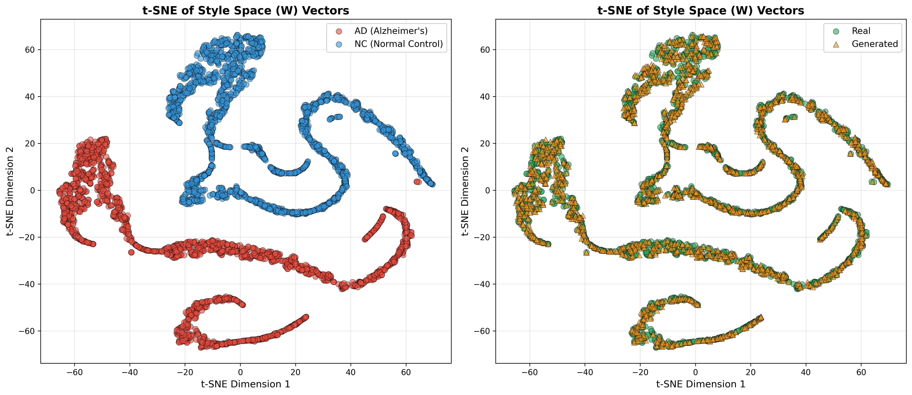
  <br>
  <em>Style Space (W-space)</em>
</p>

<p float="left">
  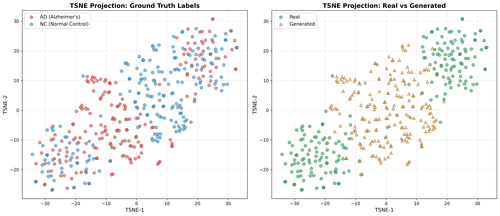
  <br>
  <em>Ground Truth Dataset</em>
</p>

*Figure 8: t-SNE embeddings visualization*

The provided t-SNE projections reveal successful class separation in the latent style space but highlight fidelity issues in the generated image feature space. Plots analyzing the Style Space (W) vectors show the Conditional Mapping Network effectively disentangles the AD and NC labels, creating two sharp, well-separated style clusters. Furthermore, the generated $W$ vectors perfectly mimic the distribution of real $W$ vectors, confirming that the generator's latent manifold is smooth, well-structured, and fully utilized, which is a key success of the StyleGAN architecture and its regularization (PL Loss).

However, when examining the image feature space (likely the Discriminator's final features), the Generated samples (triangles) fail to replicate the crisp separation seen in the Real data clusters. Instead, the generated samples predominantly populate the ambiguous space between the distinct AD and NC clusters. This means the Generator struggles to synthesize the subtle, defining features necessary to produce "pure" examples of either class. Although the model can create realistic-looking images, the features of these images lie close to the decision boundary, indicating a lack of conditional fidelity and confirming that the Generator is failing to capture the unique, high-order discriminatory features of each medical condition.

This discrepancy—perfect style separation but ambiguous image features—is likely a consequence of the Projection Discriminator overpowering the Generator, as noted in the loss analysis. The Discriminator's Projection Term quickly identifies that the Generator's output, while visually appealing, lacks the exact features required to align perfectly with the conditional label. The Generator, unable to overcome this high-dimensional penalty, opts for a safer, central manifold in the image space, producing images that are generally plausible but fail to commit fully to the strict, separating features of the target classes.

The Conditional StyleGAN is highly effective at structuring its latent space based on class labels, but it fails to transfer this distinct conditional knowledge fully into the final image features. The model successfully learns the global structure of the style space but exhibits low conditional fidelity in the output domain, meaning the resulting images are generally realistic but are diagnostically ambiguous, limiting the model's utility for reliable conditional data synthesis.

## References

1. Karras, T., et al. "Analyzing and Improving the Image Quality of StyleGAN." *CVPR 2020*. https://arxiv.org/abs/1912.04958
2. Karras, T., et al. "A Style-Based Generator Architecture for Generative Adversarial Networks." *CVPR 2019*. https://arxiv.org/abs/1812.04948
3. Miyato, T., & Koyama, M. "cGANs with Projection Discriminator." *ICLR 2018*. https://openreview.net/pdf?id=7TZeCsNOUB_
4. Mescheder, L., et al. "Which Training Methods for GANs do actually Converge?" *ICML 2018*. https://arxiv.org/abs/1802.05637
5. NVlabs StyleGAN2 Official Repository. https://github.com/NVlabs/stylegan2

## Citation

If you use this implementation in your research, please cite:

```bibtex
@misc{stylegan2_adni_2025,
  title={Conditional StyleGAN2 for AD vs NC Brain Image Generation},
  author={Tyreece Paul},
  year={2025},
  url={https://github.com/tyreecepaul/PatternAnalysis-2025}
}
```
